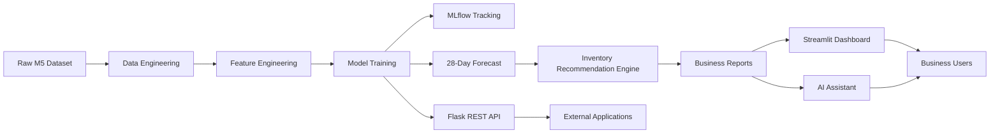
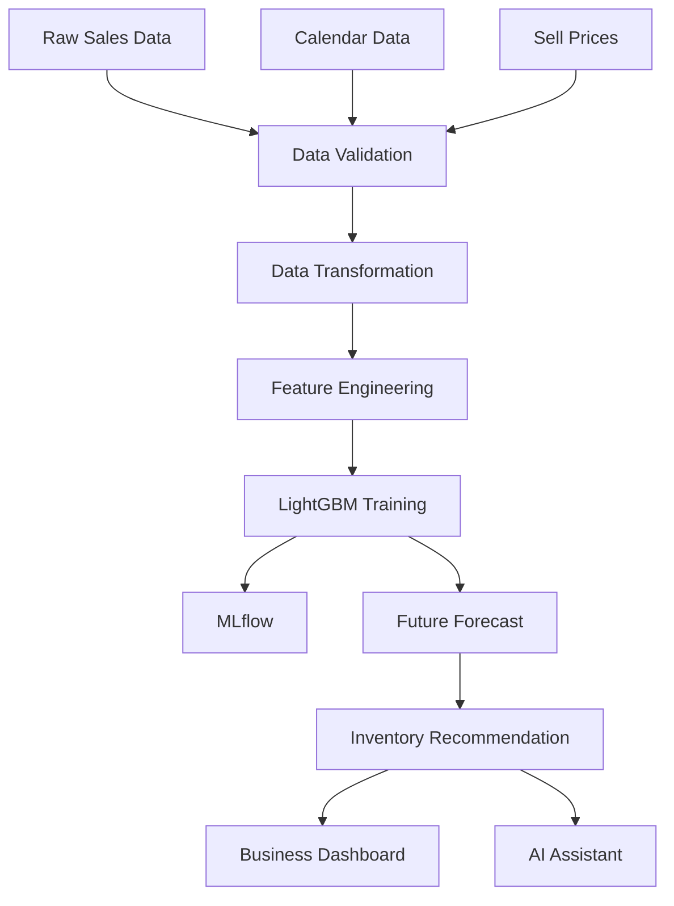
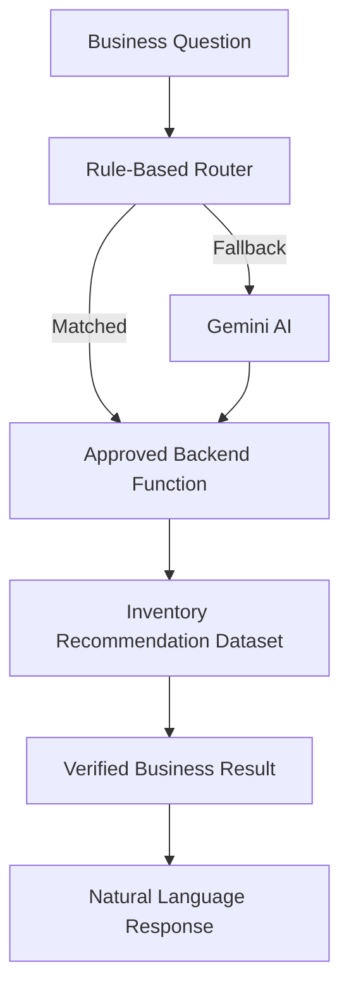
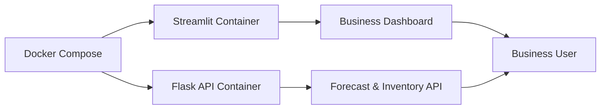

# 🛒 Intelligent Retail Demand Forecasting & Inventory Intelligence Platform

<p align="center">


</p>

---

## 🚀 Live Demo

### 🌐 Streamlit Dashboard

> **Explore the deployed application here**

**🔗 Live Demo:**  https://intelligent-forecasting-mlops-platform.streamlit.app/

---

## 📌 Project Overview

**Intelligent Retail Demand Forecasting & Inventory Intelligence Platform** is an end-to-end Machine Learning and MLOps project designed to help retail businesses make smarter inventory decisions through demand forecasting and business intelligence.

The platform predicts product demand for the next **28 days**, converts those predictions into actionable inventory recommendations, exposes forecasting capabilities through REST APIs, and provides an interactive Streamlit dashboard with an AI-powered assistant for business users.

Unlike a standalone forecasting notebook, this project demonstrates how machine learning models can be integrated into a production-oriented system that combines data engineering, model training, experiment tracking, deployment, business visualization, and natural-language interaction.

---

# 🎯 Business Problem

Retail businesses continuously face two expensive inventory challenges:

### 📉 Understocking

- Products become unavailable
- Customers leave without purchasing
- Sales opportunities are lost
- Customer satisfaction decreases

### 📈 Overstocking

- Excess capital is locked in inventory
- Warehousing costs increase
- Perishable products may expire
- Inventory turnover decreases

Making inventory decisions based solely on historical averages or manual planning often ignores important business signals such as pricing changes, seasonality, holidays, and purchasing trends.

This project addresses that problem by forecasting future product demand and translating those forecasts into practical inventory recommendations that support more informed replenishment decisions.

---

# 💡 Project Highlights

✔ End-to-End Retail Demand Forecasting Pipeline

✔ Intelligent Inventory Recommendation Engine

✔ Interactive Streamlit Business Dashboard

✔ Gemini-Powered AI Assistant with Rule-Based Fallback

✔ REST API using Flask

✔ MLflow Experiment Tracking

✔ Dockerized Multi-Service Deployment

✔ GitHub Actions Continuous Integration

✔ Production-Oriented Project Architecture

---

# 📊 Dashboard Preview

> **Executive Dashboard**

*(Insert Screenshot Here)*

---

> **Inventory Recommendation Dashboard**

*(Insert Screenshot Here)*

---

> **AI Assistant**

*(Insert Screenshot Here)*

---

# ⭐ Why This Project Stands Out

This repository goes beyond building a forecasting model.

It demonstrates the complete lifecycle of an end-to-end machine learning system, covering:

- Data Engineering
- Feature Engineering
- Time-Series Forecasting
- Business Rule Engine
- Inventory Intelligence
- Experiment Tracking
- API Development
- Interactive Dashboard
- AI Integration
- Containerization
- Continuous Integration

The result is a production-oriented portfolio project that combines Machine Learning, MLOps, Software Engineering, and AI-assisted business decision support into a single platform.

---

## Project Results

| Metric                    |                  Result |
| ------------------------- | ----------------------: |
| Forecast Horizon          |                 28 days |
| Products Forecasted       |                   1,437 |
| Dataset Size              |      ~2.75 million rows |
| Model Used                |                LightGBM |
| MAE                       |                   1.204 |
| RMSSE                     |                   0.667 |
| Improvement over Baseline |                  12.96% |
| AI Assistant Evaluation   | 20 / 20 correct intents |
| AI Assistant Accuracy     |                    100% |

---

## Tech Stack

| Layer               | Tools                                         |
| ------------------- | --------------------------------------------- |
| Programming         | Python                                        |
| Data Processing     | Pandas, NumPy, DuckDB, Parquet                |
| Machine Learning    | LightGBM, XGBoost, Scikit-learn               |
| Experiment Tracking | MLflow                                        |
| API                 | Flask                                         |
| Dashboard           | Streamlit, Plotly                             |
| AI Assistant        | Gemini API, Rule-Based Routing, Tool Registry |
| Deployment          | Docker, Docker Compose                        |
| CI/CD               | GitHub Actions                                |
| Version Control     | Git, GitHub                                   |

---

# 🏛️ Project Architecture

The platform is designed as a modular, production-oriented machine learning system where each component has a single responsibility. This separation improves maintainability, scalability, and deployment flexibility.



---

# 🗂️ Repository Structure

```text
Intelligent-Forecasting-MLOps-Platform/

│
├── data/
│   ├── raw/
│   ├── processed/
│   └── features/
│
├── models/
│
├── reports/
│
├── src/
│   ├── api/
│   ├── business/
│   ├── dashboard/
│   ├── data/
│   ├── features/
│   ├── models/
│   └── ai_assistant/
│
├── mlruns/
│
├── .github/
│   └── workflows/
│
├── Dockerfile
├── docker-compose.yml
├── requirements.txt
└── streamlit_app.py
```

The repository follows a modular architecture where data processing, machine learning, APIs, dashboard components, and AI services are organized into independent modules.

---

# 🔄 End-to-End Machine Learning Pipeline

The project follows a complete machine learning workflow from raw retail data to business decision support.



---

# 📦 Data Engineering Pipeline

The project begins by transforming multiple raw retail datasets into a unified forecasting dataset suitable for machine learning.

### Data Sources

- Historical Sales
- Calendar & Events
- Product Pricing

### Pipeline Stages

- Data Ingestion
- Data Validation
- Data Transformation
- Feature Dataset Generation

The transformed dataset serves as the single source of truth for forecasting, inventory intelligence, dashboard reporting, and AI-assisted querying.

---

# ⚙️ Feature Engineering

The forecasting model relies on multiple categories of engineered features that capture historical demand behavior, seasonality, pricing effects, and product-level characteristics.

### Historical Demand

- Lag Features
- Rolling Statistics
- Demand Trends

### Calendar Intelligence

- Weekday
- Month
- Quarter
- Weekend Indicators
- Event Information

### Pricing Features

- Historical Prices
- Price Changes
- Price Change Percentage
- Price Lags

### Product-Level Features

- Product Statistics
- Department Aggregations
- Category Aggregations
- Demand Sparsity Indicators

These engineered features enable the forecasting model to capture both short-term and long-term demand patterns.

---

# 🤖 Forecasting Engine

The platform predicts future retail demand using supervised machine learning.

### Models Evaluated

| Model | Purpose |
|---------|----------|
| Baseline Forecast | Performance Benchmark |
| XGBoost | Model Comparison |
| LightGBM | Final Production Model |

The final model was selected based on forecasting accuracy and generalization performance against a baseline forecasting approach.

---

# 📦 Inventory Intelligence Engine

Forecasts alone do not directly support business decisions.

The platform converts predicted demand into inventory recommendations that help determine:

- Which products require replenishment
- Recommended order quantities
- Target inventory levels
- Reorder points
- Demand risk categories

This additional business layer transforms machine learning predictions into operational decisions that inventory managers can use.

---

# 🤖 AI Business Assistant

The platform includes an AI-powered assistant that enables users to interact with verified inventory data using natural language.

Rather than generating inventory values directly, the assistant retrieves information through approved backend functions before generating a business-friendly response.

### Supported Business Questions

✔ Inventory Summary

✔ Products Requiring Reorder

✔ High-Risk Inventory

✔ Product-Level Recommendations

Example:

> Which products require immediate replenishment?

> Show the inventory summary.

> What is the reorder recommendation for this product?

---

## AI Assistant Architecture



### Why Hybrid Routing?

High-confidence inventory queries are processed locally through deterministic routing.

Gemini is used only when additional language understanding is required.

This approach provides:

- Faster responses
- Reduced API usage
- Lower operating cost
- Reliable business outputs
- Graceful fallback during API quota limits

---

# 🌐 REST API Layer

The forecasting platform exposes model outputs through a lightweight Flask REST API.

The API demonstrates how forecasting services can be integrated with external applications such as:

- ERP Systems
- Inventory Management Software
- Mobile Applications
- Business Dashboards

Example endpoints include:

```text
GET /health

GET /forecast/28days

GET /inventory/recommendations
```

Separating model serving from the dashboard allows the forecasting engine to be reused across multiple client applications.

---

# 📊 Streamlit Dashboard

The Streamlit application serves as the primary business interface for interacting with forecasting results.

Instead of generating predictions every time the application loads, the dashboard reads precomputed forecast and inventory reports.

This batch inference approach significantly improves dashboard responsiveness while maintaining consistent business outputs.

Dashboard capabilities include:

- Executive KPIs
- Inventory Recommendation Table
- Department Filters
- Demand Risk Analysis
- AI Assistant
- Forecast Summary

The dashboard is intended for operational users who require business insights rather than direct access to machine learning code.

---

# 🚀 Getting Started

## Live Application

The easiest way to explore this project is through the deployed Streamlit application.

### 🌐 Streamlit Dashboard

**Live Demo:**  
YOUR_STREAMLIT_LINK

No installation is required to explore the dashboard.

---

# 🔍 How to Review This Project

There are several ways to evaluate the project depending on your interests.

## Option 1 — Explore the Live Dashboard (Recommended)

Open the deployed Streamlit application to:

- View executive inventory KPIs
- Explore inventory recommendations
- Filter products by department
- Analyze demand risk levels
- Interact with the AI Assistant

This provides the quickest overview of the project's business functionality.

---

## Option 2 — Review the Source Code

The repository is organized into modular components:

| Module | Purpose |
|---------|----------|
| `src/data` | Data ingestion, validation, transformation |
| `src/features` | Feature engineering |
| `src/models` | Model training and forecasting |
| `src/business` | Inventory recommendation engine |
| `src/api` | Flask REST API |
| `src/dashboard` | Streamlit dashboard |
| `src/ai_assistant` | AI Assistant |

---

## Option 3 — Run the Project Locally

Clone the repository:

```bash
git clone https://github.com/YOUR_GITHUB_USERNAME/Intelligent-Forecasting-MLOps-Platform.git

cd Intelligent-Forecasting-MLOps-Platform
```

Create a virtual environment:

```bash
python -m venv venv
```

Activate the environment:

### Windows

```bash
venv\Scripts\activate
```

### Linux / macOS

```bash
source venv/bin/activate
```

Install project dependencies:

```bash
pip install -r requirements.txt
```

---

# ▶ Running the Streamlit Dashboard

Launch the application:

```bash
streamlit run streamlit_app.py
```

The dashboard will be available at:

```text
http://localhost:8501
```

---

# ⚙ Environment Variables

The AI Assistant uses the Gemini API.

Create a `.env` file in the project root.

Example:

```text
GEMINI_API_KEY=YOUR_API_KEY
```

For Streamlit Community Cloud deployment, configure the key inside **App Settings → Secrets**.

```toml
GEMINI_API_KEY="YOUR_API_KEY"
```

> **Important:** Never commit API keys or `.env` files to version control.

---

# 🐳 Running with Docker

The project includes Docker support for reproducible deployment.

Build and start all services:

```bash
docker compose up --build
```

Docker Compose starts:

| Service | Port |
|----------|------|
| Streamlit Dashboard | 8501 |
| Flask API | 5000 |

After deployment:

Dashboard:

```text
http://localhost:8501
```

API:

```text
http://localhost:5000
```

Stop all services:

```bash
docker compose down
```

---

# 🌐 Flask REST API

The Flask API exposes forecasting and inventory data for external applications.

### Health Check

```http
GET /health
```

### Forecast Endpoint

```http
GET /forecast/28days
```

Returns the generated 28-day demand forecast.

---

### Inventory Recommendation Endpoint

```http
GET /inventory/recommendations
```

Returns inventory recommendations generated from forecast outputs.

---

## Example API Request

```bash
curl http://localhost:5000/inventory/recommendations
```

---

# 📈 MLflow Experiment Tracking

The project uses MLflow to track machine learning experiments.

Tracked information includes:

- Parameters
- Metrics
- Model artifacts
- Feature importance
- Trained models

Launch MLflow:

```bash
mlflow ui --backend-store-uri sqlite:///mlflow.db
```

Open:

```text
http://localhost:5000
```

---

# 🔄 Continuous Integration

GitHub Actions automatically validates the project whenever new code is pushed.

The workflow includes:

- Dependency installation
- Project validation
- Import checks
- Docker image build verification

This helps ensure that the project remains reproducible and deployable across environments.

---

# 📦 Docker Deployment Overview



---

# 🛠 Deployment Summary

| Component | Technology |
|-----------|------------|
| Dashboard | Streamlit Community Cloud |
| API | Flask |
| Containerization | Docker |
| Experiment Tracking | MLflow |
| Version Control | GitHub |
| CI Pipeline | GitHub Actions |

---

# 📸 Suggested Reviewer Workflow

For the best experience, reviewers are encouraged to explore the project in the following order:

1. Open the **Live Streamlit Dashboard**
2. Review the project overview and architecture
3. Browse the repository structure
4. Inspect the forecasting and inventory modules
5. Review the AI Assistant implementation
6. Explore the Docker configuration
7. Examine the GitHub Actions workflow

This sequence provides a complete understanding of both the business capabilities and the engineering implementation.

---

# 📊 Model Performance

The forecasting pipeline was evaluated using a time-based validation strategy, where the most recent observations were held out as the test period.

The final production model was selected after comparing multiple forecasting approaches against a baseline model.

## Final Evaluation

| Metric | Result |
|----------|--------|
| Final Model | LightGBM |
| Forecast Horizon | 28 Days |
| Mean Absolute Error (MAE) | **1.204** |
| RMSSE | **0.667** |
| Improvement over Baseline | **12.96%** |

The trained model demonstrated consistent forecasting performance while maintaining efficient inference, making it suitable for downstream inventory planning.

---

# 💼 Business Impact

The objective of this project extends beyond producing accurate forecasts.

Forecasts are transformed into actionable inventory recommendations that can support operational decision-making.

The platform helps answer business questions such as:

- Which products require replenishment?
- Which products have the highest stockout risk?
- How much inventory should be ordered?
- Which departments require immediate attention?
- What inventory insights can be obtained through natural language?

By combining forecasting with inventory intelligence, the platform bridges the gap between machine learning predictions and business operations.

---

# 🧠 Key Engineering Decisions

Several design decisions were made to improve scalability, maintainability, and usability.

### Modular Project Structure

Each component of the system is separated into dedicated modules, allowing data processing, forecasting, APIs, dashboard components, and AI services to evolve independently.

---

### Batch Forecast Generation

Forecasts are generated before launching the dashboard rather than during user interaction.

This significantly improves dashboard responsiveness while ensuring consistent outputs across sessions.

---

### Business Rule Layer

Machine learning predictions are converted into business-friendly inventory recommendations using an inventory intelligence engine.

This additional layer transforms numerical forecasts into operational decisions.

---

### Hybrid AI Assistant

The AI assistant combines deterministic routing with Gemini-powered language understanding.

This approach provides:

- Faster responses
- Reduced API usage
- Lower operating cost
- Reliable business outputs
- Graceful fallback handling

---

### Experiment Tracking

MLflow is used to ensure that model training remains reproducible by tracking:

- Parameters
- Metrics
- Artifacts
- Trained models

---

### Containerized Deployment

Docker and Docker Compose provide a consistent execution environment, simplifying deployment across development and production systems.

---

# 🚀 Future Improvements

Potential enhancements include:

- Forecast all stores and product categories
- Integrate real inventory databases
- Add automated model retraining
- Implement model monitoring and drift detection
- Store model artifacts in cloud object storage (AWS S3)
- Deploy the Flask API to a cloud environment
- Add authentication and role-based dashboard access
- Support real-time inventory updates
- Expand the AI Assistant with analytical capabilities and additional business workflows

---

# 🎓 Skills Demonstrated

This project demonstrates practical experience across the end-to-end machine learning lifecycle.

### Data Engineering

- Data ingestion
- Data validation
- Data transformation
- Feature generation

### Machine Learning

- Time-series forecasting
- Feature engineering
- Model evaluation
- Hyperparameter optimization

### MLOps

- MLflow experiment tracking
- Docker containerization
- GitHub Actions CI
- Environment management

### Software Engineering

- Modular Python architecture
- REST API development
- Interactive dashboard development
- Configuration management

### Artificial Intelligence

- Gemini API integration
- Tool-based AI architecture
- Rule-based routing
- Natural-language business interaction

---

# 🙏 Acknowledgements

This project was developed using the **M5 Forecasting** dataset, a widely used benchmark for retail demand forecasting research.

Open-source technologies including Python, LightGBM, Streamlit, Flask, MLflow, Docker, and GitHub Actions made it possible to build an end-to-end machine learning platform focused on practical business applications.

---

# 📬 Contact

**Nazri Hanan**

Aspiring Data Scientist | Machine Learning Engineer

- LinkedIn: *(Add your LinkedIn profile)*
- GitHub: https://github.com/YOUR_USERNAME

---

# ⭐ If You Found This Repository Useful

If you found this project interesting, consider giving the repository a ⭐.

It helps others discover the project and supports continued development.

---

## 📄 License

This project is released under the **MIT License**.

Feel free to use, learn from, and adapt the code in accordance with the license terms.

---

<p align="center">

**Built with Python • Machine Learning • MLOps • Streamlit • Docker • MLflow • Gemini AI**

</p>
