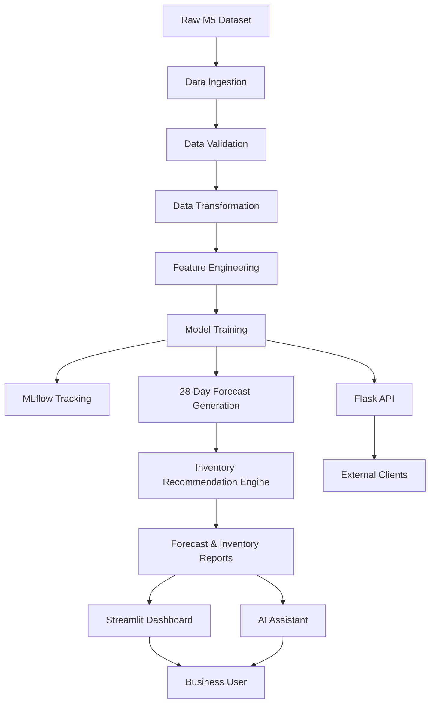
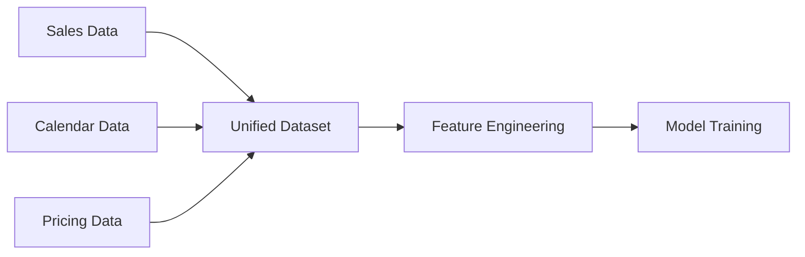
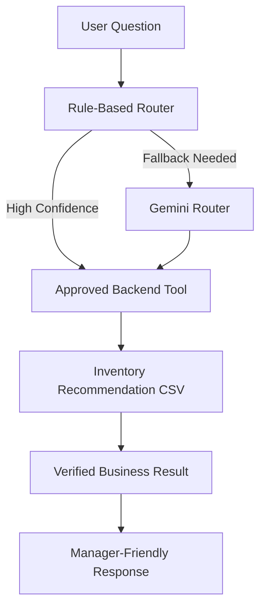

# Intelligent Retail Forecasting & Inventory Intelligence Platform

[]()
[]()
[]()
[]()
[]()
[]()

## Live Demo

**Streamlit Dashboard:** [Open Live App](YOUR_STREAMLIT_LINK_HERE)

---

## Project Overview

This project is an end-to-end **Retail Demand Forecasting and Inventory Intelligence Platform** built using the M5 retail forecasting dataset.

The platform forecasts future product demand, converts forecasts into inventory replenishment recommendations, exposes model outputs through an API, tracks experiments with MLflow, packages the application with Docker, and provides a business-facing Streamlit dashboard with an AI assistant.

The goal is not only to build a forecasting model, but to build a production-style machine learning system that connects:

* Data engineering
* Feature engineering
* Machine learning
* Experiment tracking
* Inventory decision logic
* API serving
* Dashboard visualization
* AI-assisted business querying
* Dockerized deployment
* CI validation

---

## Business Problem

Retailers need to decide how much inventory to keep for thousands of products across stores.

Poor demand planning creates two major problems:

| Problem       | Business Impact                                      |
| ------------- | ---------------------------------------------------- |
| Understocking | Stockouts, lost sales, poor customer experience      |
| Overstocking  | Higher holding cost, tied-up capital, waste/spoilage |

This project solves the problem by forecasting future demand and translating those forecasts into actionable inventory recommendations such as reorder quantity, reorder point, stock status, and demand risk level.

---

## Key Features

* Forecasts product demand for a 28-day horizon
* Uses historical sales, calendar events, SNAP indicators, and pricing data
* Builds a unified forecasting dataset from raw M5 files
* Performs feature engineering using lag, rolling, price, calendar, and aggregate features
* Trains and evaluates LightGBM and XGBoost models
* Tracks experiments, parameters, metrics, and artifacts using MLflow
* Generates inventory recommendations from forecast outputs
* Provides a Streamlit dashboard for business users
* Includes an AI assistant for natural-language inventory questions
* Exposes forecasting and inventory outputs through a Flask API
* Supports Docker and Docker Compose for reproducible execution
* Uses GitHub Actions for automated validation

---

## Project Results

| Metric                    |                  Result |
| ------------------------- | ----------------------: |
| Forecast Horizon          |                 28 days |
| Products Forecasted       |                   1,437 |
| Dataset Size              |      ~2.75 million rows |
| Model Used                |                LightGBM |
| MAE                       |                   1.204 |
| RMSSE                     |                   0.667 |
| Improvement over Baseline |                  12.96% |
| AI Assistant Evaluation   | 20 / 20 correct intents |
| AI Assistant Accuracy     |                    100% |

---

## System Architecture



---

## Tech Stack

| Layer               | Tools                                         |
| ------------------- | --------------------------------------------- |
| Programming         | Python                                        |
| Data Processing     | Pandas, NumPy, DuckDB, Parquet                |
| Machine Learning    | LightGBM, XGBoost, Scikit-learn               |
| Experiment Tracking | MLflow                                        |
| API                 | Flask                                         |
| Dashboard           | Streamlit, Plotly                             |
| AI Assistant        | Gemini API, Rule-Based Routing, Tool Registry |
| Deployment          | Docker, Docker Compose                        |
| CI/CD               | GitHub Actions                                |
| Version Control     | Git, GitHub                                   |

---

## Repository Structure

```text
Intelligent-Forecasting-MLOps-Platform/
│
├── streamlit_app.py                  # Main Streamlit dashboard entry point
├── Dockerfile                        # Docker image definition
├── docker-compose.yml                # Runs API and dashboard services
├── requirements.txt                  # Python dependencies
├── README.md                         # Project documentation
│
├── data/
│   ├── raw/                          # Raw M5 dataset files
│   ├── processed/                    # Transformed forecasting dataset
│   ├── features/                     # Feature-engineered dataset
│   └── predictions/                  # Prediction outputs
│
├── reports/
│   ├── future_28_day_forecast.csv    # 28-day forecast output
│   ├── inventory_recommendations.csv # Inventory recommendation output
│   └── model_evaluation_report.md    # Model evaluation summary
│
├── models/
│   ├── lightgbm_model.pkl            # Serialized trained model
│   ├── best_params.json              # Best model parameters
│   └── feature_importance_final.csv  # Feature importance report
│
├── src/
│   ├── data/
│   │   ├── ingest.py                 # Data loading
│   │   ├── validate.py               # Data validation
│   │   ├── explore.py                # EDA scripts
│   │   └── transform.py              # Raw-to-processed transformation
│   │
│   ├── features/
│   │   ├── data_profiling.py         # Dataset profiling
│   │   ├── eda.py                    # Exploratory analysis
│   │   └── feature_engineering.py    # Feature creation
│   │
│   ├── models/
│   │   ├── baseline.py               # Baseline forecasting model
│   │   ├── train_lightgbm.py         # LightGBM training
│   │   ├── train_lightgbm_optuna.py  # Tuned LightGBM training
│   │   ├── train_xgboost.py          # XGBoost comparison model
│   │   ├── forecast_28_days.py       # Future forecast generation
│   │   └── predict.py                # Prediction utilities
│   │
│   ├── business/
│   │   └── inventory_recommendation.py # Inventory logic
│   │
│   ├── api/
│   │   └── app.py                    # Flask API
│   │
│   ├── dashboard/
│   │   ├── components.py             # Reusable dashboard UI components
│   │   ├── config.py                 # Dashboard config
│   │   ├── data_loader.py            # Dashboard data loading
│   │   ├── sections.py               # Dashboard page sections
│   │   └── styles.py                 # Custom styling
│   │
│   └── ai_assistant/
│       ├── assistant.py              # AI assistant response layer
│       ├── tools.py                  # Approved backend tools
│       ├── tool_registry.py          # Tool mapping
│       ├── gemini_router.py          # Gemini fallback router
│       ├── prompts.py                # Assistant prompts
│       ├── schemas.py                # Response schemas
│       ├── eval_questions.csv        # Evaluation questions
│       └── evaluate_assistant.py     # Assistant evaluation
│
└── tests/                            # Test files
```

---

## How to Review This Project

### 1. Open the Live Dashboard

The easiest way to review the project is through the live Streamlit dashboard:

[Open Live Streamlit Dashboard](YOUR_STREAMLIT_LINK_HERE)

The dashboard includes:

* Executive inventory KPIs
* Reorder recommendation table
* High-risk product view
* Department-level filtering
* Forecast and inventory summaries
* AI assistant for inventory questions

---

### 2. Run Locally Without Docker

Clone the repository:

```bash
git clone https://github.com/YOUR_USERNAME/Intelligent-Forecasting-MLOps-Platform.git
cd Intelligent-Forecasting-MLOps-Platform
```

Create and activate a virtual environment:

```bash
python -m venv venv
venv\Scripts\activate
```

Install dependencies:

```bash
pip install -r requirements.txt
```

Run the Streamlit dashboard:

```bash
streamlit run streamlit_app.py
```

The dashboard will open at:

```text
http://localhost:8501
```

---

### 3. Run With Docker Compose

This project includes Docker support so the dashboard and API can be run in a reproducible environment.

Build and start the services:

```bash
docker compose up --build
```

Expected local services:

```text
Streamlit Dashboard: http://localhost:8501
Flask API:           http://localhost:5000
```

Stop the services:

```bash
docker compose down
```

---

### 4. Test the Flask API

Once the API is running, test the health endpoint:

```bash
curl http://localhost:5000/health
```

Example response:

```json
{
  "status": "healthy"
}
```

Inventory recommendation endpoint:

```bash
curl http://localhost:5000/inventory/recommendations
```

Forecast endpoint:

```bash
curl http://localhost:5000/forecast/28days
```

---

### 5. View MLflow Experiments

To inspect model training experiments:

```bash
mlflow ui --backend-store-uri sqlite:///mlflow.db
```

Then open:

```text
http://localhost:5000
```

MLflow tracks:

* Model parameters
* Evaluation metrics
* Experiment runs
* Feature importance artifacts
* Model artifacts

---

## Data Pipeline

The project starts with raw M5 retail data:

* `sales_train_validation.csv`
* `calendar.csv`
* `sell_prices.csv`

These files are processed into a unified machine-learning-ready dataset.



The transformation pipeline converts the sales data from wide format into long format and joins it with calendar and pricing information.

Final processed dataset:

```text
data/processed/sales_ca_1_foods.parquet
```

Each row represents:

```text
one product + one store + one date + sales + calendar features + price features
```

---

## Feature Engineering

The model uses multiple groups of forecasting features.

### Historical Demand Features

```text
lag_1, lag_2, lag_3, lag_7, lag_14, lag_28, lag_56
```

These help the model learn recent and seasonal sales behavior.

### Rolling Statistics

```text
rolling_mean_3
rolling_mean_7
rolling_mean_14
rolling_mean_28
rolling_mean_56
rolling_std_3
rolling_std_7
rolling_std_14
rolling_std_28
rolling_std_56
```

These capture recent demand trends and volatility.

### Calendar Features

```text
weekday
month
year
is_weekend
day_of_month
week_of_year
quarter
```

These help the model learn weekly and seasonal demand patterns.

### Price Features

```text
sell_price
previous_price
price_change
price_change_pct
price_lag_7
price_lag_28
price_change_7d
price_change_28d
```

These help capture the impact of price changes on demand.

### Product and Category Aggregates

```text
item_avg_sales
item_median_sales
item_zero_sales_ratio
dept_daily_sales
dept_rolling_mean_28
cat_rolling_mean_28
```

These help the model understand product-level and category-level behavior.

---

## Model Training

The project uses a time-based split, where the final 28 days are used as the test period.

Models trained:

| Model             | Purpose                   |
| ----------------- | ------------------------- |
| Baseline Forecast | Simple benchmark          |
| LightGBM          | Primary forecasting model |
| XGBoost           | Comparison model          |

The final model uses LightGBM because it provided strong performance on structured tabular time-series features while maintaining fast training and inference.

---

## Model Evaluation

The model is evaluated against a baseline forecast.

| Metric               | Why It Matters                               |
| -------------------- | -------------------------------------------- |
| MAE                  | Easy-to-interpret average unit error         |
| RMSE                 | Penalizes large forecasting mistakes         |
| RMSSE                | Forecasting competition-style scaled error   |
| WAPE                 | Business-friendly aggregate percentage error |
| Baseline Improvement | Shows whether ML adds value                  |

Final reported performance:

```text
MAE: 1.204
RMSSE: 0.667
Improvement over baseline: 12.96%
```

---

## Inventory Recommendation Engine

Forecasts are converted into business recommendations using inventory planning logic.

For each product, the system calculates:

| Field                 | Meaning                                   |
| --------------------- | ----------------------------------------- |
| total_28_day_forecast | Expected total demand for next 28 days    |
| avg_daily_forecast    | Average daily predicted demand            |
| max_daily_forecast    | Highest predicted daily demand            |
| forecast_std          | Demand variability                        |
| lead_time_demand      | Expected demand during supplier lead time |
| safety_stock          | Buffer stock for uncertainty              |
| reorder_point         | Inventory threshold for reorder           |
| target_stock_level    | Ideal stock level                         |
| current_inventory     | Simulated available inventory             |
| recommended_order_qty | Suggested order quantity                  |
| stock_status          | Reorder Needed / Sufficient               |
| risk_level            | Low / Medium / High Demand                |

The output is saved to:

```text
reports/inventory_recommendations.csv
```

---

## Streamlit Dashboard

The Streamlit dashboard is designed as the business-facing interface for inventory managers.

Instead of recalculating forecasts every time the dashboard loads, the dashboard reads pre-generated forecast and inventory reports. This makes the app faster and more reliable.

Dashboard pages include:

* Executive Dashboard
* Inventory Recommendations
* AI Assistant

The dashboard helps users answer:

* How many products need reorder?
* Which products are high risk?
* What is the recommended order quantity?
* Which department has more inventory pressure?
* What does the AI assistant recommend based on forecast outputs?

---

## AI Assistant

The project includes an AI assistant that allows users to ask inventory-related questions in natural language.

Example questions:

```text
Which products need reorder?
Show me inventory summary.
Which products are at stockout risk?
What is the recommendation for FOODS_1_006?
```

The assistant does not directly invent numbers. It uses approved backend tools that read verified inventory recommendation outputs.

Approved tools:

```text
get_inventory_summary()
get_stockout_products()
get_reorder_recommendation(item_id)
```

### AI Assistant Architecture



### Guardrails

The assistant is restricted to:

* Inventory summaries
* Stockout-risk products
* Reorder recommendations
* Product-specific inventory queries

Out-of-scope questions return a fallback response.

This prevents hallucinated business outputs and keeps the assistant grounded in project data.

---

## Flask API

The Flask API exposes the forecasting and inventory system programmatically.

Example endpoints:

| Endpoint                     | Purpose                          |
| ---------------------------- | -------------------------------- |
| `/health`                    | Check API health                 |
| `/forecast/28days`           | Return forecast output           |
| `/inventory/recommendations` | Return inventory recommendations |

The API demonstrates that the model output can be consumed by applications beyond the Streamlit dashboard, such as ERP systems, internal tools, or other services.

---

## Docker and Docker Compose

Docker is used to package the project into a reproducible application environment.

Docker Compose runs:

* Flask API service
* Streamlit dashboard service

This allows the project to be started with:

```bash
docker compose up --build
```

Why Docker was added:

* Avoid dependency issues across machines
* Run API and dashboard consistently
* Demonstrate production-style packaging
* Make the project easier to review and reproduce

---

## GitHub Actions CI

The project includes a GitHub Actions workflow for automated validation.

The CI pipeline verifies:

* Dependency installation
* Python package imports
* Project module imports
* Docker image build

The workflow intentionally does not retrain the model on every push because model training is computationally expensive and unnecessary for fast CI validation.

---

## Engineering Decisions

### Why use a representative subset?

The original M5 dataset is large. During development, the project uses the CA_1 store and FOODS category as a representative subset.

This allowed faster iteration while preserving realistic retail demand patterns, pricing behavior, calendar effects, and product-level variation.

The same pipeline can be extended to more stores and categories with larger compute resources.

---

### Why use batch inference for the dashboard?

Generating forecasts for 1,437 products across a 28-day horizon can be expensive.

Instead of recalculating forecasts every time the dashboard loads, the project generates forecast and inventory reports as batch outputs.

The dashboard then reads these reports directly.

This improves:

* Dashboard speed
* Reliability
* User experience
* Demo stability

---

### Why keep Flask API if Streamlit reads CSV reports?

The Streamlit dashboard is optimized for business users.

The Flask API demonstrates model-serving capability for other systems.

This separation creates two serving modes:

| Mode                | Purpose                   |
| ------------------- | ------------------------- |
| Streamlit Dashboard | Fast business reporting   |
| Flask API           | Programmatic model access |

This is closer to production ML system design.

---

### Why use MLflow?

MLflow tracks model experiments and makes model development reproducible.

It stores:

* Parameters
* Metrics
* Artifacts
* Model runs
* Feature importance

This makes model comparison more reliable than manually tracking results.

---

### Why use an AI assistant?

The dashboard shows visual evidence.

The AI assistant allows users to ask quick questions conversationally.

Together:

```text
Dashboard = visual decision support
AI Assistant = natural-language query layer
Forecasting model = prediction engine
Inventory engine = business decision layer
```

---

## Example Inventory Output

Example business interpretation for one product:

```text
Product: FOODS_1_006
Forecast horizon: 28 days
Predicted demand: 30.69 units
Average daily demand: 1.09 units
Current inventory: 7 units
Reorder point: 7.86 units
Recommended order quantity: 24 units
Stock status: Reorder Needed
Risk level: High Demand
```

This converts raw model predictions into a decision a retail manager can act on.

---

## Environment Variables

For Gemini integration, create a `.env` file locally:

```text
GEMINI_API_KEY=your_api_key_here
```

Do not commit `.env` to GitHub.

For Streamlit Community Cloud, add the key under:

```text
App Settings → Secrets
```

Example:

```toml
GEMINI_API_KEY = "your_api_key_here"
```

---

## Important Notes

* `current_inventory` is simulated in this project because real inventory system data is not available in the M5 dataset.
* The project uses a representative development subset: CA_1 store and FOODS category.
* Forecast and inventory reports are precomputed for dashboard performance.
* The AI assistant is grounded in generated inventory recommendation data and does not create business metrics independently.

---

## Future Improvements

Potential future enhancements:

* Add real inventory database integration
* Deploy API and dashboard to a cloud platform
* Add AWS S3 artifact storage
* Add pagination and filtering to API endpoints
* Add model monitoring and data drift detection
* Add scheduled retraining workflow
* Extend forecasting to all stores and categories
* Build an executive Power BI dashboard
* Add authentication for business users
* Add model registry promotion workflow

---

## What This Project Demonstrates

This project demonstrates practical skills across the full machine learning lifecycle:

* Data pipeline development
* Time-series feature engineering
* Forecasting model training
* Baseline comparison
* MLflow experiment tracking
* Model serialization
* Inventory optimization logic
* API development
* Dashboard development
* AI assistant integration
* Dockerized deployment
* CI automation
* Production-oriented system thinking

---

## Author

**Nazri Hanan**
Aspiring Data Scientist / Machine Learning Engineer

This project was built as a production-style portfolio project to demonstrate practical machine learning, MLOps, and business-focused analytics engineering.
