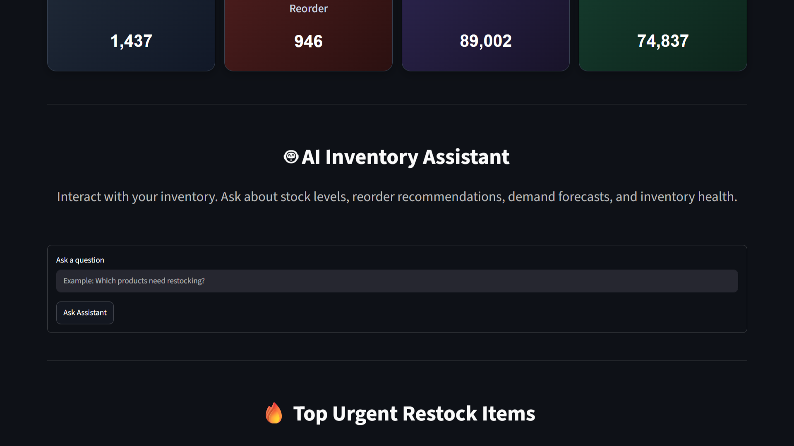
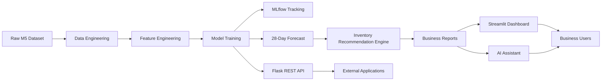
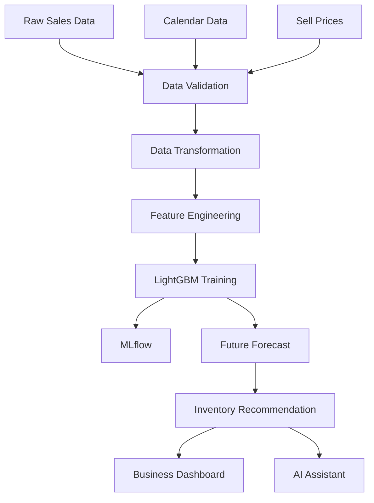
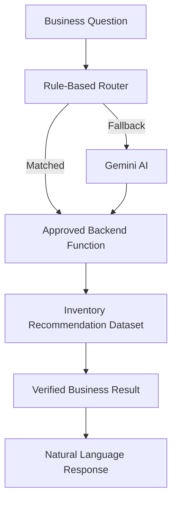
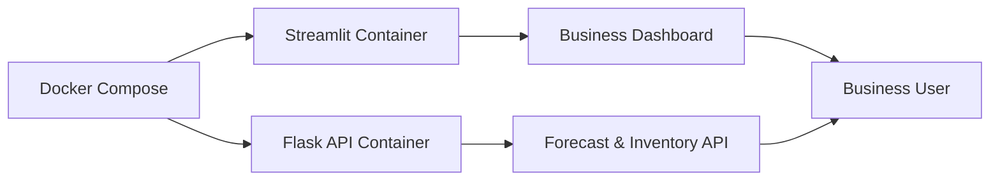

#  **Intelligent Retail Demand Forecasting & Inventory Intelligence Platform**

*Predict retail demand, optimize inventory decisions, and explore business insights through machine learning, interactive analytics, and an AI-powered assistant.*

**Live Interactive Streamlit Dashboard Demo** : https://intelligent-forecasting-mlops-platform.streamlit.app/

---

## 📸 **Dashboard Preview**

<p align="center">
  
  
</p>

<p align="center">
  
  
</p>

<p align="center">
  
</p>

---

## **Project Overview**

The **Intelligent Retail Demand Forecasting & Inventory Intelligence Platform** is a production-oriented analytics application that helps retailers forecast product demand, optimize inventory decisions, and explore business insights through an interactive dashboard and AI-powered assistant.

Built on the M5 Forecasting dataset, the platform combines data engineering, feature engineering, machine learning, inventory intelligence, experiment tracking, REST APIs, containerized deployment, and interactive analytics into a single business-focused solution.

---

## **Business Problem**

Retail businesses continuously face two expensive inventory challenges:

### **Understocking**

- Products become unavailable
- Customers leave without purchasing
- Sales opportunities are lost
- Customer satisfaction decreases

### **Overstocking**

- Excess capital is locked in inventory
- Warehousing costs increase
- Perishable products may expire
- Inventory turnover decreases

Making inventory decisions based solely on historical averages or manual planning often ignores important business signals such as pricing changes, seasonality, holidays, and purchasing trends.

This project addresses that problem by forecasting future product demand and translating those forecasts into practical inventory recommendations that support more informed replenishment decisions.

---

##  **Key Features**

| Feature | Description |
|----------|-------------|
| 📈 **28-Day Demand Forecasting** | Predicts future product demand using a LightGBM forecasting model trained on historical sales, pricing, and calendar features. |
| 📦 **Inventory Intelligence** | Converts forecasts into reorder quantities, reorder points, target stock levels, and demand risk categories. |
| 📊 **Interactive Dashboard** | Streamlit dashboard for exploring KPIs, inventory recommendations, business insights, and operational analytics. |
| 🤖 **AI Business Assistant** | Supports natural-language inventory queries using Gemini with deterministic rule-based routing for reliable responses. |
| 🌐 **REST API** | Flask API exposes forecasting and inventory endpoints for integration with external applications. |
| 📈 **MLflow Tracking** | Tracks experiments, model parameters, evaluation metrics, and trained model artifacts. |
| 🐳 **Dockerized Deployment** | Containerized deployment using Docker and Docker Compose for reproducible execution. |
| ⚙️ **Continuous Integration** | GitHub Actions automatically validates project builds and dependencies on every push. |


---

## **Tech Stack**

| Layer               | Tools                                         |
| ------------------- | --------------------------------------------- |
| Programming         | Python                                        |
| Data Processing     | Pandas, NumPy, DuckDB, Parquet                |
| Machine Learning    | LightGBM, XGBoost, Scikit-learn               |
| Experiment Tracking | MLflow                                        |
| API                 | Flask                                         |
| Dashboard           | Streamlit, Plotly                             |
| AI Assistant        | Gemini API, Rule-Based Routing, Tool Registry |
| Deployment          | Docker, Docker Compose                        |
| CI/CD               | GitHub Actions                                |
| Version Control     | Git, GitHub                                   |

---

## **Project Architecture**

The platform is designed as a modular, production-oriented machine learning system where each component has a single responsibility. This separation improves maintainability, scalability, and deployment flexibility.



---


````markdown
<details>

<summary><b>📂 Repository Structure</b></summary>

<br>

```text
Intelligent-Forecasting-MLOps-Platform/

│
├── data/
│   ├── raw/
│   ├── processed/
│   └── features/
│
├── models/
│
├── reports/
│
├── src/
│   ├── api/
│   ├── business/
│   ├── dashboard/
│   ├── data/
│   ├── features/
│   ├── models/
│   └── ai_assistant/
│
├── mlruns/
│
├── .github/
│   └── workflows/
│
├── Dockerfile
├── docker-compose.yml
├── requirements.txt
└── streamlit_app.py

````

The repository follows a modular architecture where data processing, machine learning, APIs, dashboard components, and AI services are organized into independent modules.

---

## **End-to-End Machine Learning Pipeline**

The project follows a complete machine learning workflow from raw retail data to business decision support.



---

## **Data Engineering Pipeline**

The forecasting pipeline begins by integrating historical sales, calendar events, and pricing data into a unified feature dataset.

The pipeline performs:

- Data ingestion
- Data validation
- Data transformation
- Feature dataset generation

The resulting dataset serves as the foundation for forecasting, inventory recommendations, dashboard reporting, and AI-assisted business queries.

---

## **Feature Engineering**

The forecasting model uses engineered features to capture historical demand patterns, seasonality, pricing behavior, and product-level characteristics.

Feature categories include:

- Historical demand features (lags and rolling statistics)
- Calendar and seasonal features
- Pricing and price change features
- Product, department, and category aggregations

These features help the model learn both short-term demand fluctuations and long-term purchasing trends.

---

## **Forecasting & Inventory Intelligence**

The platform forecasts retail demand using a supervised machine learning model and transforms those predictions into actionable inventory recommendations.

### **Forecasting**

The final production model was selected after comparing multiple forecasting approaches against a baseline model.

| Model | Purpose |
|--------|---------|
| Baseline | Performance benchmark |
| XGBoost | Model comparison |
| **LightGBM** | Final production model |

### **Inventory Intelligence**

Forecasts are converted into business-ready recommendations, including:

- Recommended order quantity
- Reorder point
- Target stock level
- Demand risk category

This business layer bridges the gap between machine learning predictions and operational inventory planning.

---

## **MLflow Experiment Tracking**

MLflow is used to track model training experiments, including parameters, evaluation metrics, and model artifacts. This ensures that experiments remain reproducible and makes it easier to compare different forecasting models throughout development.

---

## **AI Business Assistant**

The platform includes an AI-powered assistant that enables users to query inventory insights using natural language.

To ensure reliable business responses, the assistant retrieves verified data through predefined backend functions instead of generating inventory values directly.

### **Supported Business Questions**

- Inventory summary
- Products requiring replenishment
- High-risk inventory items
- Product-level reorder recommendations

### **Example Queries:**

- Which products require immediate replenishment?
- Show the inventory summary.
- What is the reorder recommendation for this product?

### **Assistant Architecture**



> High-confidence inventory queries are processed locally through deterministic routing. Gemini is used only when additional language understanding is required.

### **Design Benefits**

- Faster responses
- Reduced API usage
- Lower operating cost
- Reliable business outputs
- Graceful fallback during API quota limits

---

## **REST API Layer**

The platform exposes forecasting and inventory capabilities through a lightweight Flask REST API, enabling integration with external applications and business workflows.

| Endpoint | Description |
|----------|-------------|
| `GET /health` | Service health check |
| `GET /forecast/28days` | Retrieve 28-day demand forecasts |
| `GET /inventory/recommendations` | Retrieve inventory recommendations |

---

## **Streamlit Dashboard**

The Streamlit application serves as the primary business interface for interacting with forecasting results.

Instead of generating predictions every time the application loads, the dashboard reads precomputed forecast and inventory reports.

This batch inference approach significantly improves dashboard responsiveness while maintaining consistent business outputs.

Dashboard capabilities include:

- Executive KPIs
- Inventory Recommendation Table
- Department Filters
- Demand Risk Analysis
- AI Assistant
- Forecast Summary

The dashboard is intended for operational users who require business insights rather than direct access to machine learning code.

---

## **Continuous Integration**

GitHub Actions automatically validates the project whenever new code is pushed.

The workflow includes:

- Dependency installation
- Project validation
- Import checks
- Docker image build verification

This helps ensure that the project remains reproducible and deployable across environments.

---

## **Docker Deployment**

The project is fully containerized using Docker and Docker Compose, providing a reproducible environment for both the Streamlit dashboard and Flask API.



Start all services with:

```bash
docker compose up --build
```

| Service | Default Port |
|----------|-------------:|
| Streamlit Dashboard | 8501 |
| Flask REST API | 5000 |

---

## **Model Performance**

The forecasting pipeline was evaluated using a time-based validation strategy, where the most recent observations were held out as the test period.

The final production model was selected after comparing multiple forecasting approaches against a baseline model.

### **Final Evaluation**

| Metric | Result |
|----------|--------|
| Final Model | LightGBM |
| Forecast Horizon | 28 Days |
| Mean Absolute Error (MAE) | **1.204** |
| RMSSE | **0.667** |
| Improvement over Baseline | **12.96%** |

The trained model demonstrated consistent forecasting performance while maintaining efficient inference, making it suitable for downstream inventory planning.

---

## **Business Impact**

The objective of this project extends beyond producing accurate forecasts.

Forecasts are transformed into actionable inventory recommendations that can support operational decision-making.

The platform helps answer business questions such as:

- Which products require replenishment?
- Which products have the highest stockout risk?
- How much inventory should be ordered?
- Which departments require immediate attention?
- What inventory insights can be obtained through natural language?

By combining forecasting with inventory intelligence, the platform bridges the gap between machine learning predictions and business operations.

---

## **Project Results**

| Metric                    |                  Result |
| ------------------------- | ----------------------: |
| Forecast Horizon          |                 28 days |
| Products Forecasted       |                   1,437 |
| Dataset Size              |      ~2.75 million rows |
| Model Used                |                LightGBM |
| MAE                       |                   1.204 |
| RMSSE                     |                   0.667 |
| Improvement over Baseline |                  12.96% |
| AI Assistant Evaluation   | 20 / 20 correct intents |
| AI Assistant Accuracy     |                    100% |

---

## **Engineering Highlights**

The platform was designed with practical software engineering principles to improve performance, maintainability, and usability.

- **Modular architecture** – The project is organized into independent modules for data processing, forecasting, business logic, APIs, the dashboard, and the AI Assistant, making the codebase easier to maintain and extend.

- **Precomputed forecasting pipeline** – Forecasts are generated before the dashboard loads, reducing response times and providing a smoother user experience.

- **Business-focused recommendations** – Instead of displaying raw predictions, the system converts forecasts into reorder quantities, reorder points, and inventory recommendations that are directly useful for decision-making.

- **Hybrid AI Assistant** – High-confidence inventory questions are handled through deterministic routing, while Gemini is used for natural language understanding, balancing reliability with flexibility.

- **Reproducible experimentation** – MLflow tracks parameters, metrics, and model artifacts, making experiments easy to reproduce and compare.

- **Containerized deployment** – Docker and Docker Compose ensure that the dashboard and API can be deployed consistently across different environments.

---

## **Future Improvements**

Potential enhancements include:

- Forecast all stores and product categories
- Integrate real inventory databases
- Add automated model retraining
- Implement model monitoring and drift detection
- Store model artifacts in cloud object storage (AWS S3)
- Deploy the Flask API to a cloud environment
- Add authentication and role-based dashboard access
- Support real-time inventory updates
- Expand the AI Assistant with analytical capabilities and additional business workflows

---
### **Acknowledgements**

This project uses the **M5 Forecasting** dataset, one of the most widely used public benchmarks for retail demand forecasting research.

Special thanks to the open-source community and the developers of Python, LightGBM, Streamlit, Flask, MLflow, Docker, and GitHub Actions for making projects like this possible.

---

### **Connect With Me**

**Hanan**

Aspiring Data Scientist & ML Engineer

-  LinkedIn: https://linkedin.com/in/hanan-nazri
-  GitHub: https://github.com/hanannazri
